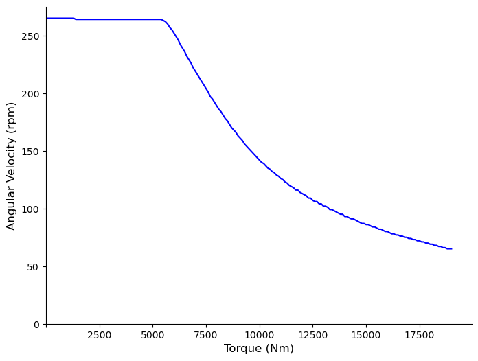
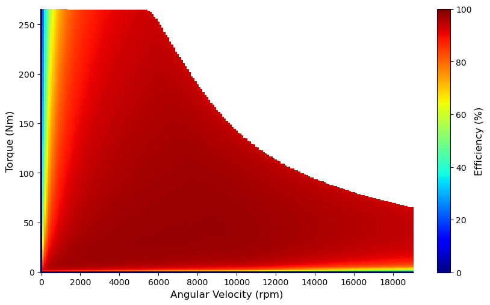

# Master Thesis

<center><h2>Electrical Engine Efficiency Prediction Bypassing Finite Element Analysis</h2></center>

## 📋 Overview

The aim of the Master Thesis is to train a neural network to learn the parameters of Electric Motors and thus be able to predict its KPIs(key performance indicators). 

We have developed and trained a MLP neural network on the tabular representation of data to predict 2 KPIs. 

The KPIs are 2D and 3D plots on Torque(Mgrenz) curve and Efficiency(ETA) grid.


## 📷 KPIs

| Torque Curve                               | Efficiency Grid                             |
|--------------------------------------------|---------------------------------------------|
|  |  |


### ⚙️ Dependencies

[]()

#### 🖥️ Operating System

Linux

#### 🐍 Environment

Create conda environment with the dependencies from .yml file as below:

```bash
conda env create -f environment.yml
conda activate thesis
```

When executing the program with python virtual environment

```bash
python -m thesis venv
source ./thesis/bin/activate
pip install -r requirements.txt
```

### 📁 Repo Structure

```python
.
├── src
│   ├── __init__.py
│   ├── README.md   
│   ├── data_preprocessing_tabular.py
│   ├── inference.py
│   ├── model.py
│   ├── scaling.py
│   ├── table_creation.py
│   ├── training.py
│   └── utils.py
├── GraphModelling
│   ├── src
│   │   ├── __init__.py
│   │   ├── README.md 
│   │   ├── data_preprocessing_graph.py
│   │   ├── dataset_creation.py
│   │   ├── model.py
│   │   ├── scaling.py
│   │   ├── graph_creation.py
│   │   └── training.py
│   └── main_graph.ipynb  
│   └── main_graph.py
├── data
│   ├── README.md   
│   ├── raw
│   ├── DoubleVGraph.json
│   ├── EMTabular.json
│   ├── Testing
│       └── raw
├── Intermediate
│   ├── README.md
│   ├── cross_val_splits.npy
│   ├── max_mgrenz.pkl
│   ├── min_mgrenz.pkl
│   ├── x_mean.pkl
│   └── x_stddev.pkl
├── Manuscript
│   ├── README.md
│   ├── ReportImages
│   ├── wandb
│   │   ├── loss
│   │   └── score
│   ├── Report.pdf
│   └── Report.tex
├── Presentations
│    └── README.md
├── .gitignore
├── environment.yaml
├── LICENSE
├── README.md
├── requirements.txt
├── data_preprocessing.py
├── main.ipynb
├── main_train.py
└── .env.local
```

## 📖 Usage

### 🔑 Secrets (.env.local)
  
WANDB_API_KEY=API KEY

### 🗃️ Data Preprocessing

Store the files for training within folder data -> raw

Run the below command for generating preprocessed tabular data

```bash
python data_preprocessing.py
```

The jupyter notebook main.ipynb hosts the code for the remaining  sections

### 📊 Data Exploration

Data explorations based on tabular summary statistics and Standard Deviation

### 🏋️ Training

To run training separately for already processed files

```bash
python main_train.py
```

To run training for new files and if you want to supply the maximum and minimum torque instead of script finding from whole dataset.
Example values maximum and minimum torque 283 and 55 then run

```bash
python main_train.py --max_torque 283 --min_torque 55
```

### 🔍 Inference

There are options to either :

1. Generate model predictions of new files, store them in folder data -> Testing -> raw and run the cell highlighted in the main.ipynb notebook

2. Generate model predictions of test dataset separated before training, in that case simply skip the cell mentioned in Step 1.

### 📈 Evaluation

Evaluation of Predictions are based on RMSE, Deviation of Folds, Difference Overlaps, Percentage Differences